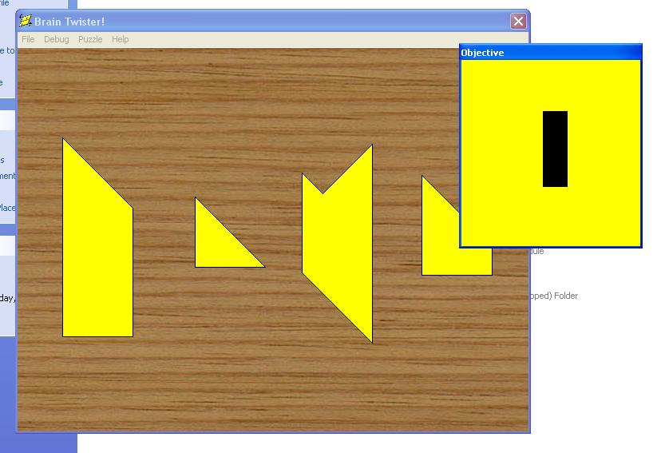



## Brain Twister Puzzle Game

### Description

Brain Twister is based on a cheap yellow plastic puzzle toy that tests your abstract skills by requiring you to recreate depicted shapes using only

four different shaped pieces by rotating, flipping and aligning them. See Readme.txt for lots more info. (Updated) Cleaned out the code a bit, moved the objective into its own window. Rendering is now done on a continual basis, i.e. not only when the mouse moves. This makes it more game-like in design. Thought of adding a time-attack mode...
 
### More Info
 

             |
---                |---
**Submitted On**   |2005-07-07 05:19:04
**By**             |[David Santos](https://github.com/Planet-Source-Code/PSCIndex/blob/master/ByAuthor/david-santos.md)
**Level**          |Intermediate
**User Rating**    |5.0 (10 globes from 2 users)
**Compatibility**  |VB 5\.0, VB 6\.0
**Category**       |[Games](https://github.com/Planet-Source-Code/PSCIndex/blob/master/ByCategory/games__1-38.md)
**World**          |[Visual Basic](https://github.com/Planet-Source-Code/PSCIndex/blob/master/ByWorld/visual-basic.md)
**Archive File**   |[Brain\_Twis191025772005\.zip](https://github.com/Planet-Source-Code/david-santos-brain-twister-puzzle-game__1-61396/archive/master.zip)

